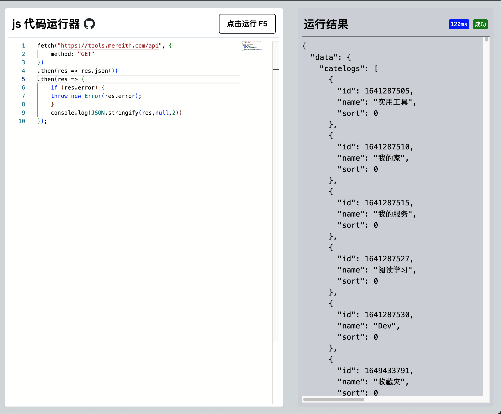

# js-web-runner
js 代码在线执行器



## 项目介绍
有时候想要快速验证一下 js 代码的执行结果，但浏览器里面的没有 node 相关的 api。 然后好像我发现自己掌握了做一个这样的在线执行器的所有技术点，所以就做了一个。

## 部署
### Docker 部署
```bash
docker run --name js-web-runner -p 3010:3000 -d --restart always mereith/js-web-runner:latest
```

打开 http://<ip>:3010/ 即可访问。

### Verce 部署
[](https://vercel.com/import/project?template=https://github.com/mereithhh/js-web-runner)